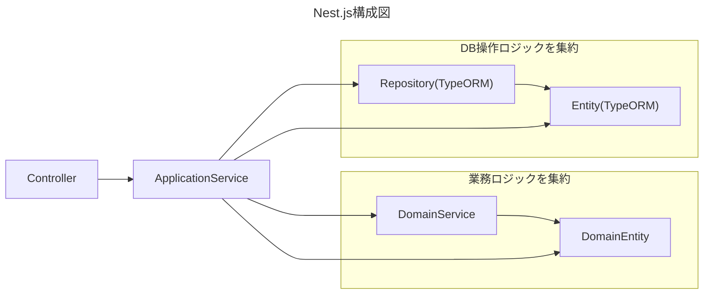
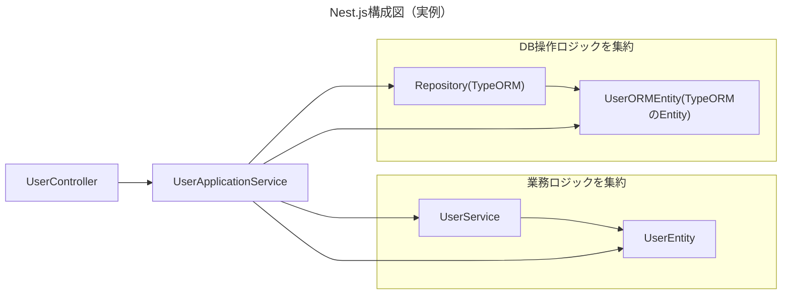

### 本構成の課題
- DomainEntityにドメインロジックとデータを入れる場合、  
TypeORMのRepositoryAPIを使ってデータ保存等を行う際にTypeOrmのEntityである必要がある為、その変換処理（Data Transfer Class等を用意する）が必要になり、  
余計なコードが増える。

- 上述の変換処理を行うために、  
下記処理を行う自作のRepositryクラスを作成する必要があり、  
さらにその分コードが増える。
    - TypeORMのRepositoryをラップし、  
本クラス経由でDBデータのCRUDを行うようにする
    - TypeORMとDomainEntityの相互変換処理を行う

- TypeORMのEntity定義時、クラス名そのままではテーブル名にできないため、  
テーブル名の明示的な設定が必要（1行増えるのみ）

### 要修正
- 下記構成はTypeORMのリポジトリを直接使う構成になっているため、  
DomainEntityにロジックを置く以上、自作Repositoryを作成する必要があるため、  
構成図と解説表の記載を修正する。

- サービスメソッドは、取得は取得のみ、更新は更新のみ（データの取得は行わない）というように、自身の役割のみを純粋に果たすようにし、アプリケーションサービスがそれらを組みあわせてロジックを作るようにする。
    - 場合によっては、さらにそれらを組み合わせた複合サービスを作成し、それをアプリケーションサービスに呼び出させる

- DBへのsaveやupdateを行う一連の処理は、カスタムリポジトリのメソッド内に業務ロジックと併せて書く。そうすることで、アプリケーションサービス自身はDBの操作やDBへ保存するための変換処理や、注文データを注文テーブルと注文詳細テーブルに分けて格納する処理などを書かなくなり、カスタムリポジトリのメソッド(=業務上の操作名)だけを呼び出すのみになる。
    - これにより、アプリケーションサービスはDB操作を意識することなく、あくまで業務のシナリオを表すサービスやリポジトリのメソッド順番に呼び出すだけになり、疎結合化すると共に、業務ロジックを各サービスやリポジトリといった再利用可能な部品として定義することができるようになる。

| コンポーネント名   | 役割・解説                                                                                                                                                                                                                                                                                                                                                                                            |
| ------------------ | ----------------------------------------------------------------------------------------------------------------------------------------------------------------------------------------------------------------------------------------------------------------------------------------------------------------------------------------------------------------------------------------------------- |
| Controller         | Nest.jsのコントローラ （ユーザや注文など、各機能の大分類ごとに作成）  Controller内のロジックには基本的に下記のみ記載し、ルーティング一覧のように扱う。 ・引数パラメータのDtoによるバリデーション ・ApplicationServiceの呼び出し処理1行                                                                                                                                              |
| ApplicationService | Nest.jsのコントローラのメソッド(API)と一対一になるサービス。 後述のクラスやサービスを呼び出し、API毎の処理を記載していく。                                                                                                                                                                                                                                                                         |
| DomainClass        | （各Serviceで共通で利用する。そのため、Commonフォルダにドメイン名フォルダを切ってまとめて格納する） 各データの値をプロパティとして持ち、そのプロパティを利用するメソッドをこのクラスにまとめる （例：ユーザ自身の名称変更や、 リクエスト受信時のバリデーションで行なわず、処理時に行うバリデーション（外部APIを呼び出しての検証や、DBのレコードを取得しての検証）など）                      |
| DomainService      | 業務ロジックを格納するサービス （各Serviceで共通で利用する。そのため、Commonフォルダにドメイン名フォルダを切ってまとめて格納する） オブジェクト同士の比較や変換など、DomainClass（もの）自身が行うには不自然な処理や、DomainClassを超えて行う処理をこのサービスにまとめる                                                                                                                       |
| Repository         | TypeORMのリポジトリAPI。データの保存や更新を行う。 複雑な検索処理なども格納する （TypeORM標準に無いカスタムな検索処理等を実装する場合は、公式ドキュメントに沿ってTypeORMのカスタムリポジトリを作成する） 本来は、特定のORMライブラリに依存すべきでない為、TypeORMのRepositoryをラップする自作Repositoryが必要だが、そこまで厳密にするとその分コードが増えてしまう為TypeORMのを直接利用する。 |
| Entity             | TypORMのEntity(=テーブル定義)。 TypeORMでテーブル定義用のmigrationファイルを生成するために利用されると共に、Repositoryで取得したレコードを表すデータクラス。                                                                                                                                                                                                                                       |
